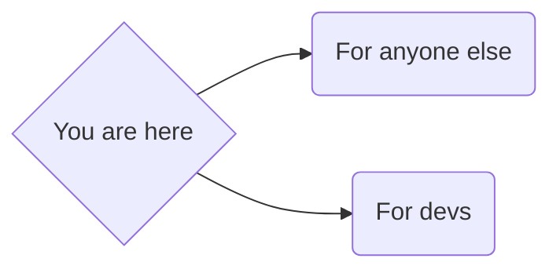

# Welcome to APOD Calendar!
This is a calendar made with the APOD (Astronomy picture of the day) in each day as a preview. In some cases the picture is a video, you can identify them becase has a default picture.
When you click the photo it will display a modal where you can see the full picture or a video if it's the case.

## How to use
In the router, you can set the year and the month that you want to see.
The route path look like this `/[year]/[month]`, only numbers available.
For example if you want the 2023 February, you must go to `/2023/2`

## How to set up the project
- To start you need to clone the repo.
Open a terminal and run
`git clone <repo url>`
use the https url for now

- Next you need to setup the repo
For that you need to open a terminal in your repo folder and run
`npm install`
This command will install all repo dependencies

- When the intallation is running, you can copy the `.env.template` file and change its name to `.env.local`
And then complete the `=` with data, if you don't have an API key, you can use the demo key: `DEMO_KEY` or generate your own key here: https://api.nasa.gov/index.html

- Here the path road fork
If you are dev take the dev road if you are not take the everyone way

## For everyone
- Start the project with:
`npm run build & npm run start`
when the command ends, go to http://localhost:3000/ to see the page

## For devs
- Start the project with:
`npm run dev`
when the command ends, go to http://localhost:3000/ to see the page